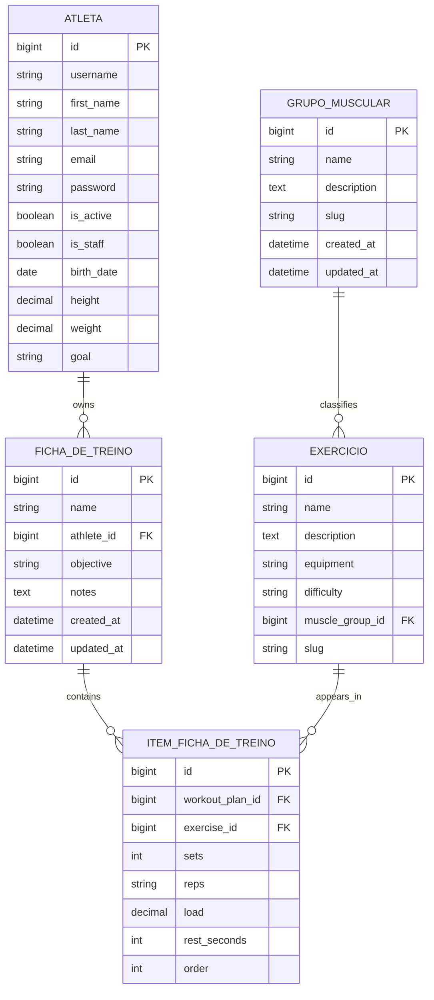

# Gym Tracker - Database ER Diagram

Este documento descreve o diagrama ER implementado para o banco de dados do projeto Gym Tracker.

O diagrama acompanha a modelagem inicial criada em Django para atender as regras da atividade: pelo menos 4 modelos, um usuario customizado herdando de `AbstractUser`, relacionamentos `ForeignKey` e relacionamento muitos-para-muitos representado por modelo intermediario.

## Modelos

### Atleta

Representa o usuario principal do sistema e herda de `AbstractUser`.

Campos adicionais implementados:

- `birth_date`
- `height`
- `weight`
- `goal`

Relacionamento principal:

- Um `Atleta` pode ter varias `FichaDeTreino`.

### GrupoMuscular

Representa uma categoria anatomica usada para organizar exercicios.

Campos implementados:

- `name`
- `description`
- `slug`
- `created_at`
- `updated_at`

Relacionamento principal:

- Um `GrupoMuscular` pode ter varios `Exercicio`.

### Exercicio

Representa um exercicio do catalogo do sistema.

Campos implementados:

- `name`
- `description`
- `equipment`
- `difficulty`
- `muscle_group`
- `slug`

Relacionamentos principais:

- Um `Exercicio` pertence a um `GrupoMuscular`.
- Um `Exercicio` pode aparecer em varias fichas por meio de `ItemFichaDeTreino`.

### FichaDeTreino

Representa um plano de treino associado a um atleta.

Campos implementados:

- `name`
- `athlete`
- `objective`
- `notes`
- `exercises`
- `created_at`
- `updated_at`

Relacionamentos principais:

- Uma `FichaDeTreino` pertence a um `Atleta`.
- Uma `FichaDeTreino` possui varios `ItemFichaDeTreino`.
- Uma `FichaDeTreino` possui varios `Exercicio` por meio de `ItemFichaDeTreino`.

### ItemFichaDeTreino

Representa o modelo intermediario entre `FichaDeTreino` e `Exercicio`.

Esse modelo guarda os dados especificos da prescricao do exercicio dentro de uma ficha.

Campos implementados:

- `workout_plan`
- `exercise`
- `sets`
- `reps`
- `load`
- `rest_seconds`
- `order`

Relacionamentos principais:

- Um `ItemFichaDeTreino` pertence a uma `FichaDeTreino`.
- Um `ItemFichaDeTreino` referencia um `Exercicio`.

## Relacionamentos

Relacionamentos implementados:

- `Atleta` 1:N `FichaDeTreino`.
- `GrupoMuscular` 1:N `Exercicio`.
- `FichaDeTreino` 1:N `ItemFichaDeTreino`.
- `Exercicio` 1:N `ItemFichaDeTreino`.
- `FichaDeTreino` e `Exercicio` possuem relacao N:N por meio de `ItemFichaDeTreino`.

## Mermaid ER

## Arquivos do diagrama

Os arquivos visuais do diagrama estao em:

- `docs/database/gym-tracker.drawio`
- `docs/database/gym-tracker-er-diagram..png`

Ao abrir o PR de modelagem, anexe o arquivo `.drawio` e a imagem PNG na descricao do PR para facilitar a revisao da estrutura do banco.

Se os arquivos forem renomeados futuramente, atualize esta documentacao para manter os caminhos sincronizados.
