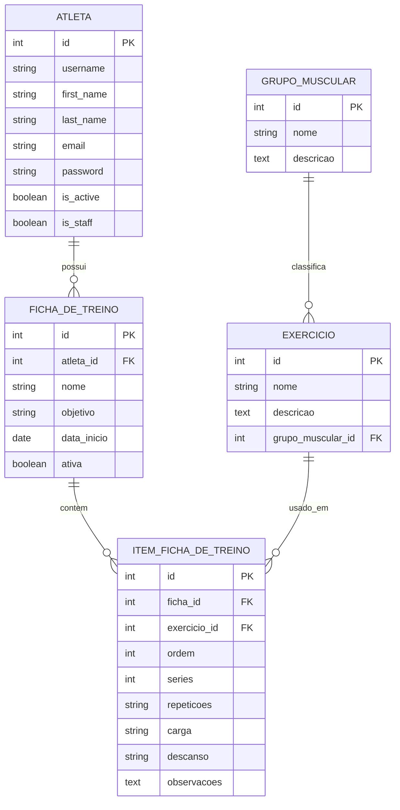

# Gym Tracker - Database ER Diagram

Este documento descreve o diagrama ER planejado para o banco de dados do projeto Gym Tracker.

O objetivo e registrar a estrutura esperada dos modelos antes da implementacao em Django, garantindo que o PR de modelagem tenha uma referencia clara para revisao.

## Contexto da atividade

- O projeto precisa ter pelo menos 4 modelos.
- Um modelo precisa herdar de `AbstractUser`.
- O projeto precisa ter relacionamentos entre modelos.
- O diagrama da estrutura do banco precisa ser anexado ao PR.
- Nesta etapa, nenhum arquivo `models.py`, migration ou view deve ser alterado.

## Modelos

### Atleta

Representa o usuario principal do sistema.

`Atleta` deve herdar de `AbstractUser` para aproveitar a autenticacao nativa do Django, incluindo login, senha, status de usuario, acesso ao admin e permissoes basicas.

Relacionamento principal:

- Um `Atleta` pode ter varias `FichaDeTreino`.

### GrupoMuscular

Representa uma categoria anatomica usada para organizar exercicios.

Exemplos:

- Peito.
- Costas.
- Pernas.
- Ombros.
- Biceps.
- Triceps.
- Abdomen.

Relacionamento principal:

- Um `GrupoMuscular` pode ter varios `Exercicio`.

### Exercicio

Representa um exercicio do catalogo do sistema.

Exemplos:

- Supino reto.
- Agachamento.
- Remada baixa.
- Desenvolvimento.

Relacionamentos principais:

- Um `Exercicio` pertence a um `GrupoMuscular`.
- Um `Exercicio` pode aparecer em varias fichas por meio de `ItemFichaDeTreino`.

### FichaDeTreino

Representa um plano de treino associado a um atleta.

Uma ficha pode conter varios exercicios, mas essa relacao precisa guardar detalhes especificos, como ordem, series, repeticoes, carga e observacoes.

Relacionamentos principais:

- Uma `FichaDeTreino` pertence a um `Atleta`.
- Uma `FichaDeTreino` possui varios `ItemFichaDeTreino`.
- Uma `FichaDeTreino` se relaciona com varios `Exercicio` por meio de `ItemFichaDeTreino`.

### ItemFichaDeTreino

Representa o item intermediario entre `FichaDeTreino` e `Exercicio`.

Esse modelo existe porque a relacao entre ficha e exercicio precisa guardar dados proprios da prescricao do treino.

Exemplos de dados do item:

- Ordem do exercicio na ficha.
- Numero de series.
- Repeticoes.
- Carga sugerida.
- Tempo de descanso.
- Observacoes.

Relacionamentos principais:

- Um `ItemFichaDeTreino` pertence a uma `FichaDeTreino`.
- Um `ItemFichaDeTreino` referencia um `Exercicio`.

## Relacionamentos

Relacionamentos planejados:

- `Atleta` 1:N `FichaDeTreino`.
- `GrupoMuscular` 1:N `Exercicio`.
- `FichaDeTreino` 1:N `ItemFichaDeTreino`.
- `Exercicio` 1:N `ItemFichaDeTreino`.
- `FichaDeTreino` e `Exercicio` possuem relacao N:N representada por `ItemFichaDeTreino`.

## Mermaid ER

## Arquivos do diagrama

Os arquivos visuais do diagrama estao em:

- `docs/database/gym-tracker.drawio`
- `docs/database/gym-tracker-er-diagram..png`

Ao abrir o PR de modelagem, anexe o arquivo `.drawio` e a imagem PNG na descricao do PR para facilitar a revisao da estrutura do banco.

Se os arquivos forem renomeados futuramente, atualize esta documentacao para manter os caminhos sincronizados.

## Limites desta etapa

Esta etapa cria apenas documentacao do diagrama ER.

Nao deve alterar:

- `models.py`
- migrations
- views
- templates HTML
- arquivos CSS
- configuracoes Django
